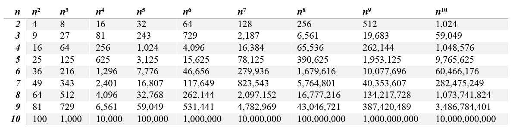

# Discrete Mathematics
* Base Conversion (Binary/Octal/Decimal/Hexadecimal)
* Matrices
* Graphs (with/without weighting)
* Edgelists (with/without weighting)
* Adjacency Matrices (with/without weighting)
* Bitwise

## Resources
* Binary to Hexadecimal/Decimal Converter: https://www.rapidtables.com/convert/number/binary-to-hex.html
* How to Convert Binary to Hexadecimal: https://www.wikihow.com/Convert-Binary-to-Hexadecimal
* Matrix Calculator: https://matrixcalc.org/en/

## Number Systems
Base (or radix) is simply the number of digits that a number system has.

As we move from right to left, the number is talking about increasing powers of the base.

**Remember!**
```
x^0 = 1
x^1 = x
```

**Decimal** (base 10) has 10 digits: 0, 1, 2, 3, 4, 5, 6, 7, 8, 9

**Binary** (base 2) has 2 digits: 0, 1

**Octal** (base 8) has 8 digits: 0, 1, 2, 3, 4, 5, 6, 7

**Hexadecimal** (base 16) has 16 digits: 0, 1, 2, 3, 4, 5, 6, 7, 8, 9, A, B, C, D, E, F,

There are other number systems that have a different base.


### Number System Methods
#### Decimal (Base 10) to String
To convert a decimal (base 10) number to a string, in the base specified.

In Ruby:
```ruby
Integer.to_s(base)
# Integer.to_s(base) converts a decimal number to a string representing the number in the base specified.

# Converts decimal (base 10) to binary (base 2):
puts 205.to_s(2)
# 11001101

# Converts decimal (base 10) to hexadecimal (base 16):
puts 180.to_s(16)
# b4
```

In JavaScript:
```js
NumberObject.toString(radix)
// NumberObject.toString(radix) converts a decimal number to a string representing the number in the base (radix) specified.

// Converts decimal (base 10) to binary (base 2):
let i = 205
console.log(i.toString(2))
// 11001101

// Converts decimal (base 10) to hexadecimal (base 16):
let i = 180
console.log(i.toString(16))
// b4
```
#### String to Decimal (Base 10)
To convert a number represented in a string at a specified base to an decimal (base 10) integer.

In Ruby:
```ruby
String.to_i(base)
# String.to_i(base) converts a string to an integer representing the number in the base specified.

# Convert binary (base 2) to decimal (base 10)
puts "11001101".to_i(2)
# 205

# Converts base 3 to decimal (base 10)
puts "21201".to_i(3)
# 208

# Converts hexadecimal (base 16) to decimal (base 10)
puts "b4".to_i(16)
# 180
```

In JavaScript:
```js
parseInt(string, radix)
// parseInt(string, radix) converts a string to a decimal (base 10) integer from the base specified as radix.

// Converts binary (base 2) to decimal (base 10):
let string = "11001101"
console.log(parseInt(string, 2))
// 205

// Converts base 3 to decimal (base 10)
let string = "21201"
console.log(parseInt(string, 3))
// 208

// Converts hexadecimal (base 16) to decimal (base 10)
let string = "b4"
console.log(parseInt(string, 16))
// 180
```

### Exponents


#### Hexidemical
http://www.linfo.org/hexadecimal.html

#### Binary Exponents
2^x  | =
-----|-----
2^0  | 1
2^1  | 2
2^2  | 4
2^3  | 8
2^4  | 16
2^5  | 32
2^6  | 64
2^7  | 128
2^8  | 256
2^9  | 512
2^10 | 1,024
2^11 | 2,048
2^12 | 4,096
2^13 | 8,192
2^14 | 16,384
2^15 | 32,768
2^16 | 65,536
2^17 | 131,072
2^18 | 262,144
2^19 | 524,288
2^20 | 1,048,576

#### Binary to Hexadecimal
Binary | Hexadecimal
-------| ------------
0 	   | 0
1 	   | 1
10 	   | 2
11 	   | 3
100    | 4
101    | 5
110    | 6
111    | 7
1000   | 8
1001   | 9
1010   | A
1011   | B
1100   | C
1101   | D
1110   | E
1111   | F

